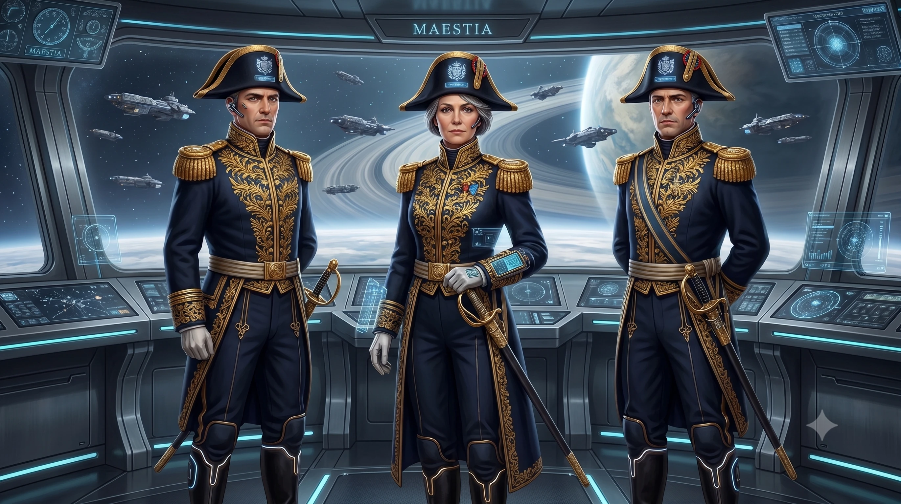
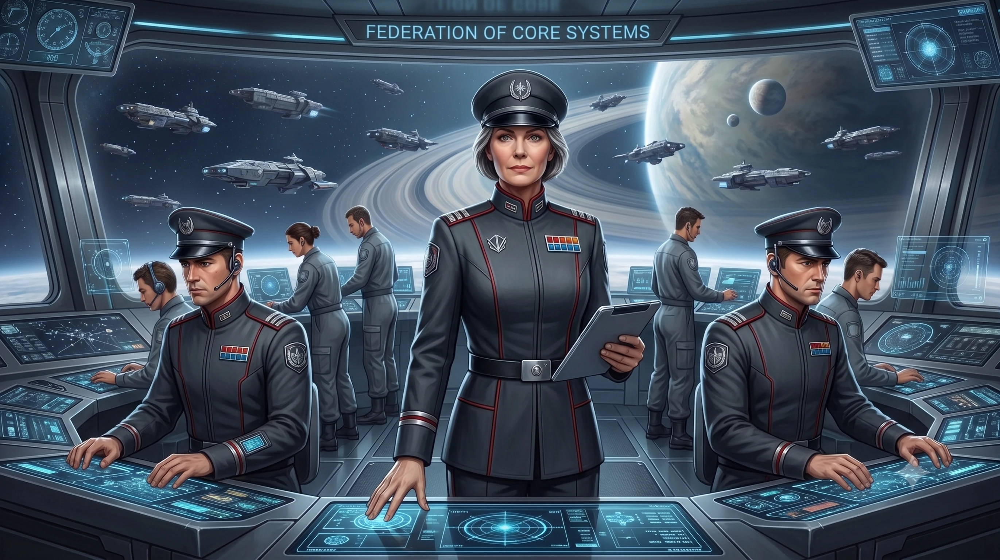
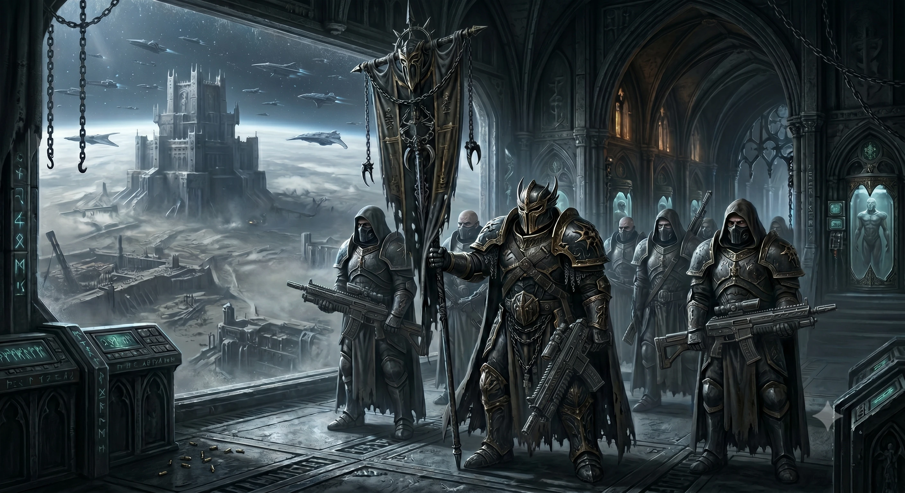

# Factions

## Major Factions

### The Empire of Maestia

The empire of Maestia is the oldest of the major factions. It is the only directly surviving faction from the great war. The Maestian puts a lot of weight on tradition and ceremony. The military uniforms of the Maestians are very ornate.
The Maestians are quite racist and elitistic, but they are generally not very expansionistic. They are however quite territorial, and defend their systems vigorously.

### The Alliance of Free Worlds

The Alliance of Free Worlds are not a political governing body as such. It is a purely military alliance designed to combat the threat that the free worlds near the core face from the Federation and other larger factions. They are a very diverse faction consisting of lots of independent worlds and systems.

### Federation of Core Systems

The Federation is the largest faction in the known galaxy. It was founded about 200 years ago, when 4 of the core systems united to fight against the Ombra. It has expanded constantly since then. The Federation believe that the galaxy should be united under one rule.

All colonies or worlds containing over 1 million (1 000 000) citizens, or over 1 trillion (1 000 000 000 000) credits in annual resource production are entitled 1 seat at the council with the exception of the 4 founding systems that are entitled two seats.

A chairman is elected by the council for 16 standard years at a time. Any decisions by the chairman can be overruled by a large majority vote (75%).

### Ethife

The Ethife is a race of spacers. They have no planetary colonies, and tend to live in large space stations. They tend to be physically adapted to living in space. They usually don't bother with gravity on their ships as they are quite adopted to living i zero-G.

They can vary a lot in appearance, since they use a lot of genetic mods, but they tend to have a quite thin build, and are usually quite tall.

The Ethife doesn't have one central government or military leader. But they do have a strong cultural bond, and often come to the aid of other Ethife against outside threats.

The Ethife have the largest fleet of all factions, but few of their ships are geared only towards combat. They tend to be quite careful in their use of their fleet, and are generally not regarded as an aggressive faction.

### Primus Vexillarius (The Ombra)

Primus Vexillarius, commonly called The Ombra, where a fleet of ships stranded in a desolate solar system during the great war. The fleet sailed through normal space to the closest populated system. Because they where low on fuel, and some warp drives where broken, they used 1G acceleration to get there. This resulted in a journey of over 100 years.

By the time they got there they had already formed a society based on military discipline, and hatred for their enemies. They used cloning technology to renew their aging warrior pool.

When they arrived they conquered and enslaved the colony, but The Ombra where so entrenched in their ways that they continued to rule from their ships in orbit. They have since then continued to conquer systems and enslave planets. They always establish orbital stations and/or fortresses on the planets that are isolated from the rest of the population.

## Minor Factions

### Archos Corporation

The Archos Corporation is in charge of operating all the gates. The are a neutral organization placed in that position by all the major factions, as they didn't want anyone messing with the gates as part of warfare.

The Archos Corporation has very high standards regarding personnel and employ a lot of anti-corruption practices to ensure the gates are operated by competent and ethical personnel. These measures are not always 100% effective. But even though problems do occur, it's still considered better than the alternative.

The gates are run according to very strict protocols. They can always technically be shut down by anyone in proximity to the gate, but in almost all systems this is highly illegal to do.
